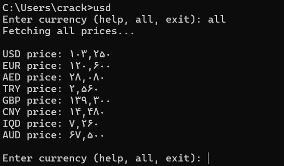

# 📌 ابزار نمایش قیمت ارزها در ترمینال ویندوز

این ابزار یک برنامه‌ی ساده است که قیمت لحظه‌ای ارزهای مختلف (دلار، یورو، پوند، درهم، لیر، یوان، دینار، دلار استرالیا و ...) را در CMD ویندوز نمایش می‌دهد. کافیست یک بار نصب و راه‌اندازی کنید و بعد تنها با نوشتن دستور `usd` در ترمینال، قیمت ارزها را ببینید.

---

## ⚙️ مراحل نصب و اجرا

### 1️⃣ نصب پایتون
ابتدا باید Python 3 روی سیستم شما نصب باشد. اگر ندارید، از این لینک دانلود کنید: [Python.org](https://www.python.org/downloads/)

🔹 در هنگام نصب گزینه **Add Python to PATH** را فعال کنید.

### 2️⃣ نصب کتابخانه‌های مورد نیاز
بعد از نصب پایتون، ترمینال (CMD) را باز کنید و دستور زیر را بزنید:

```bash
pip install requests beautifulsoup4
```

### 3️⃣ کپی کردن فایل‌ها
فایل‌های پروژه شامل:

- `usd.py` (کد اصلی پایتون)
- `usd.bat` (فایل اجرایی برای CMD)
- `README.md` (همین راهنما)
- `cmd.png` (عکس نمونه اجرا)

را در مسیر زیر کپی کنید:

```
C:\Users\<YourName>\
```

🔹 توجه: به‌جای `<YourName>` نام کاربری ویندوز خود را بگذارید. مثلا:

```
C:\Users\crack\
```

### 4️⃣ اجرای برنامه
حالا در CMD فقط کافیست تایپ کنید:

```
usd
```

---

## 📌 راهنما

- وقتی برنامه اجرا شود، از شما اسم ارز را می‌خواهد.
- اگر دستور `help` را بزنید، لیست همه ارزها نمایش داده می‌شود.
- اگر دستور `all` را بزنید، قیمت همه ارزها با هم نشان داده می‌شود.
- برای دیدن قیمت یک ارز خاص (مثلا دلار):

```bash
usd
```

سپس در برنامه تایپ کنید:

```bash
usd
```

- برای خروج از برنامه:

```bash
exit
```

---

## 📝 نمونه خروجی

```
Enter currency (or type help, exit to quit): usd
USD price: 101,950

Enter currency (or type help, exit to quit): all
USD price: 101,950
EUR price: 109,500
AED price: 27,700
...
```

---

## ✨ امکانات
- دریافت قیمت لحظه‌ای از سایت
- نمایش قیمت یک ارز خاص یا همه ارزها
- اجرای سریع تنها با یک دستور ساده (`usd`) در CMD

---

